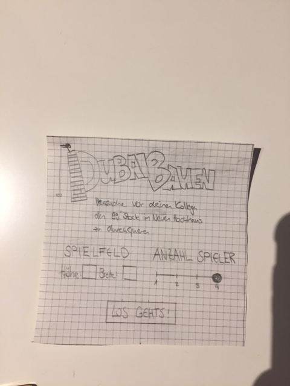
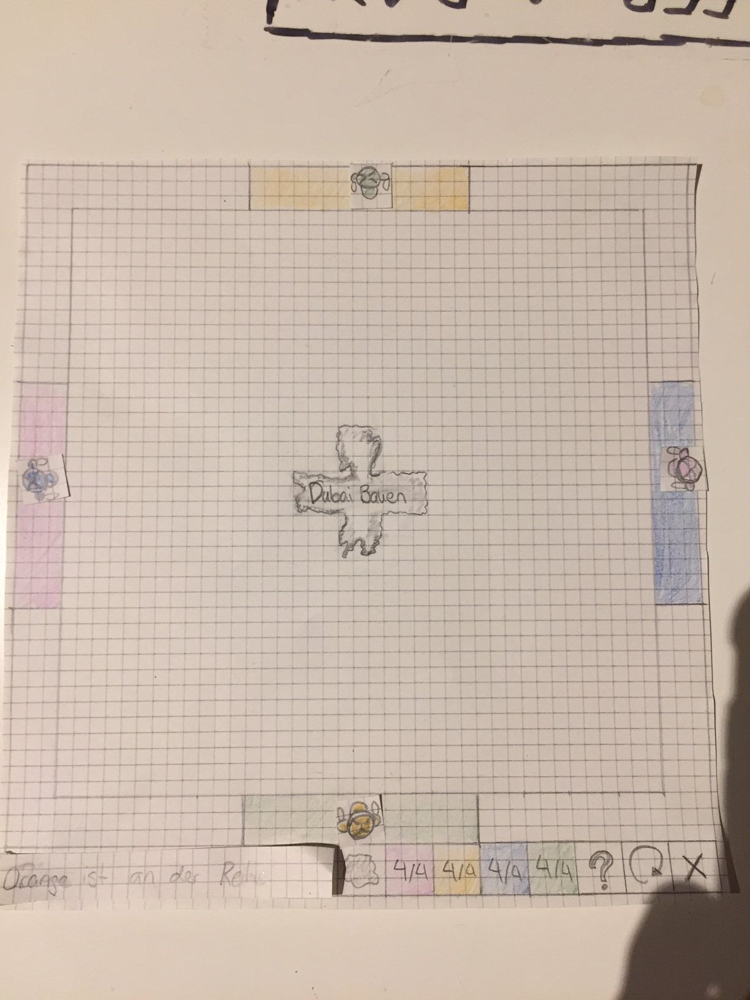
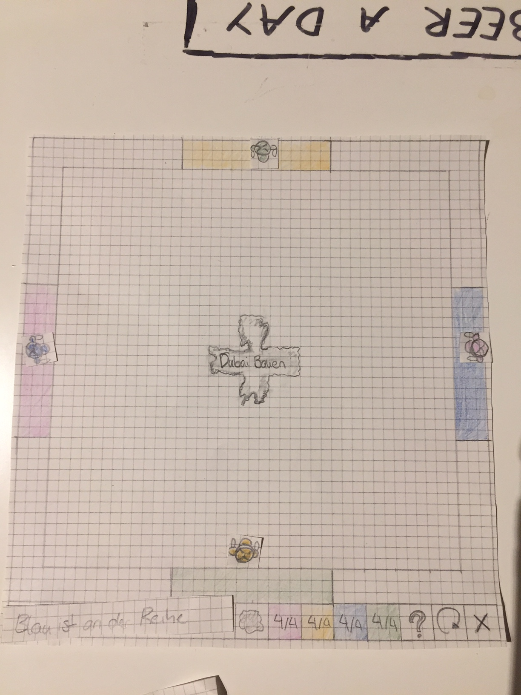
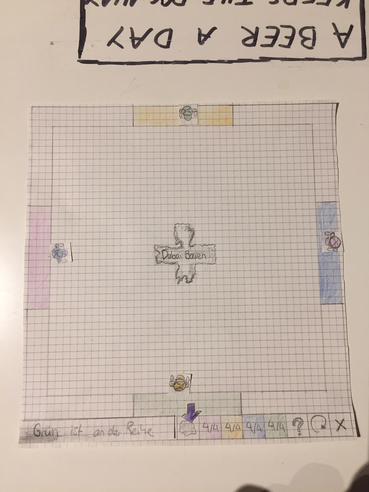
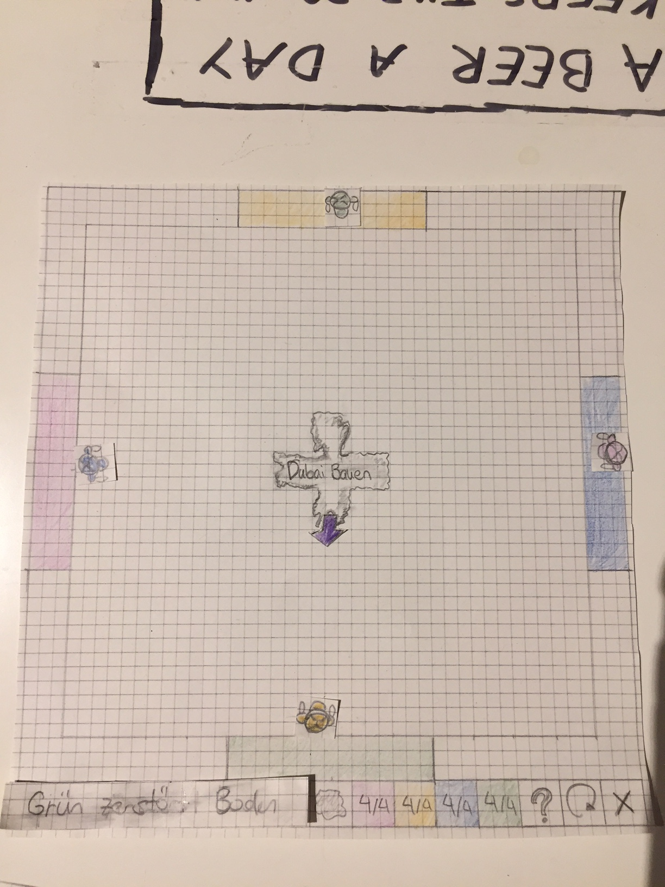
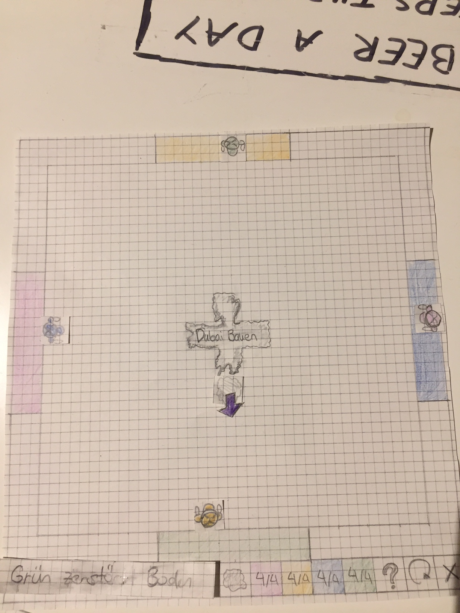
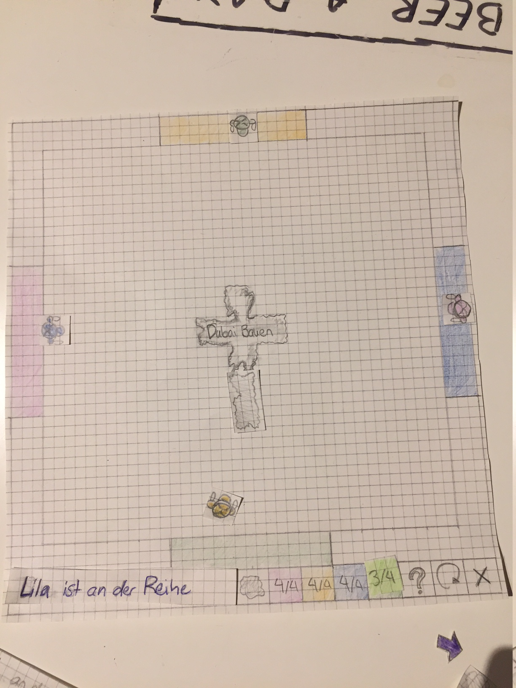
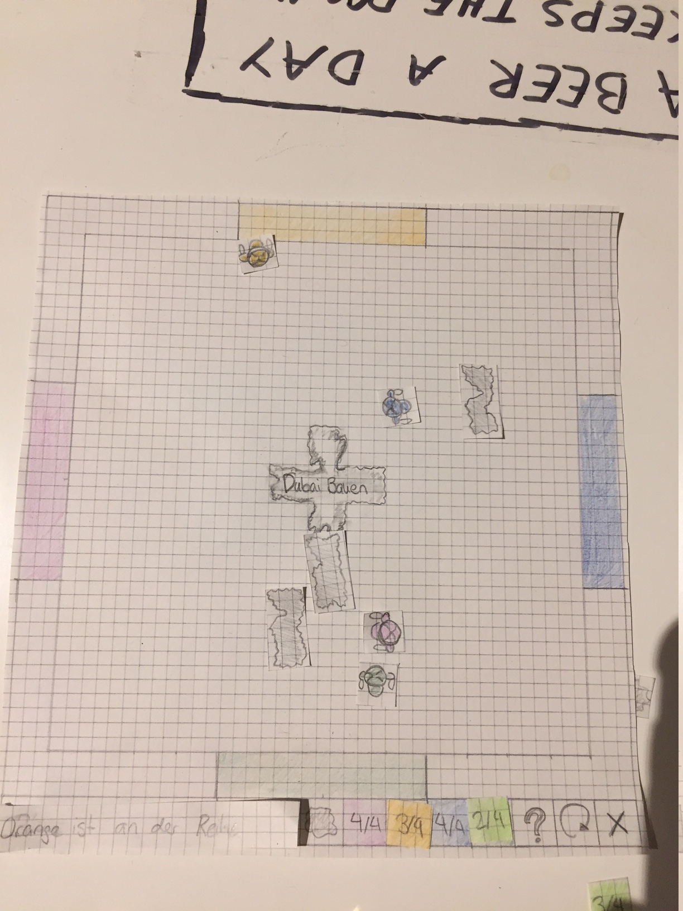
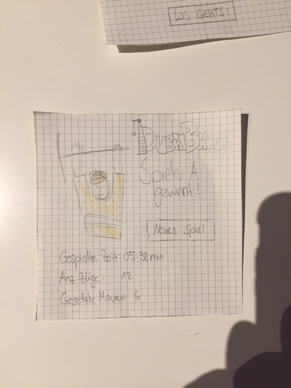

Prototype
====================
Group09 Samuel Schwegler und Alain Stulz
##Dubai Bauen
 Das Spiel findet in Dubai auf einer Hochhaus-Baustelle statt. 
Man muss versuchen als Bauarbeiter im 99. Stock von der einen zur anderen Seite zu kommmen. Statt Mauern gibt Löcher im Boden über die man natürlich nicht gehen kann.
Das Menü ist in einer Zeile ganz unten und zeigt immer an wie viele "Mauern" noch bleiben. Bietet zusätzlich ein Hilfefenster und die Option zum Neustart.
###Startscreen

 Im Startbildschirm kann man gleich die Spielspezifikationen wählen. Die Spielfeldgrösse muss man eintragen via Tastatur, die Anzahl Spieler kann man mit einem Slider zwischen eins und vier wählen.
###Startzustand

 Im Beispiel gibt es vier Spieler. In der untersten Zeile ist das Menü mit einem Mitteilungsfenster, der  Option Löcher zu platzieren, der Anzahl noch verfügbaren Löcher pro Spieler (Spieler werden nach Farbe benannt). Die Möglichkeit ein Infofenster zu öffnen, auf den Neustart Knopf zu Drücken um in den Startscreen zurückzukehren.
 In der Mitte des Spielfeldes gibt es schon vorgegebener zerstörter Boden, in der Mitte der Spielnamen.
###Normale Bewegung

 Nach dem Orange gefahren per Tastaturklick ist, darf nun Blau ziehen und so geht es im Uhrzeigersinn weiter.
###Wall placement

 Gründ drückt per Mausklick auf das Loch Symbol, nun wechselt das Programm in den Zerstören Modus.
Auf dem Tisch im Hintergrund ist übrigens der Spruch "A BEER A DAY KEEPS THE DOCTOR AWAY" zu lesen.
 
 
 Per Klick in das Spielfeld werden die beiden Felder gewählt die durchlöchert werden sollen. Nach dem zweiten Klick kommt der nächste Spieler an die Reihe und kann wieder entweder per Pfeiltasten ziehen oder per Maus den Boden zerstören.

 Hier sehen wir wie das erste Loch im Boden platziert wurde.
###Sieg

 Orange ist an der Reihe und einen Zug vor seiner orangen Zone und somit dem Sieg, zieht jetz natürlich nach vorne
 
 Das Spiel zeigt den Siegscreen an mit zusätzlichen Infos wie Spieldauer. Mit Klick auf Neues Spiel gelang man wieder in den Setup-Screen.