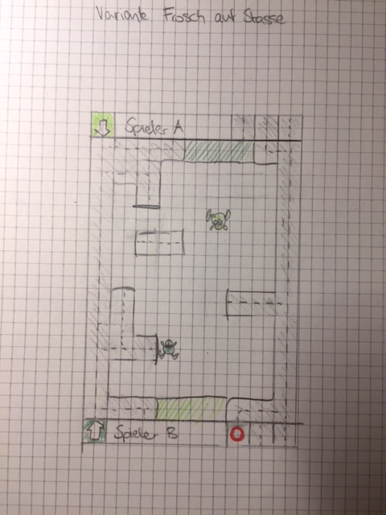

Sketches
====================
Group09 Samuel Schwegler und Alain Stulz
##Für bis zu vier Spieler
###Variante Baustelle

 Die Gewählte Variante. Das Spiel findet in Dubai auf einer Baustelle statt. 
Man muss versuchen im 99. Stock von der einen zur anderen Seite zu kommmen. Statt Mauern gibt Löcher im Boden über die man natürlich nicht gehen kann.
Das Menü ist in einer Zeile ganz unten und zeigt immer an wie viele "Mauern" noch bleiben. Bietet zusätzlich ein Hilfefenster und die Option zum Neustart
###Variante viele Farben

 Viele Bunte Farben, im Ziel werden die verbleibenden Anzahl Mauern angezeigt. Das Menü ist in der unteren Wand eingebaut.
###Variante Kellner

 In einem Restaurannt müssen Kellner die Teller an den Tisch bringen. Die anderen Kellner können Tische in den Weg stellen.
##Für zwei Spieler
###Variante L(abirinth)

 Das Spielfeld ist wie ein L angeordnet. Bietet der Vorteil das das Menü im Spielfeld ist, ist jedoch vermutlich schwer umzusetzen.
###Variante Fisch im Wald

 Ein Fisch versucht hüpfend das Gewässer zu wechseln, würde sicher lustig aussehen.
###Variante Frosch um Strassen

 Frösche versuchen in das andere Gebiet einzudringen, statt Mauern gibt es Strassen die der Frosch nicht überqueren kann.
